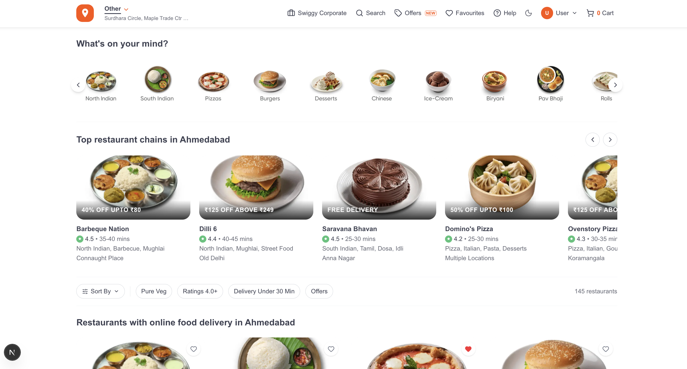
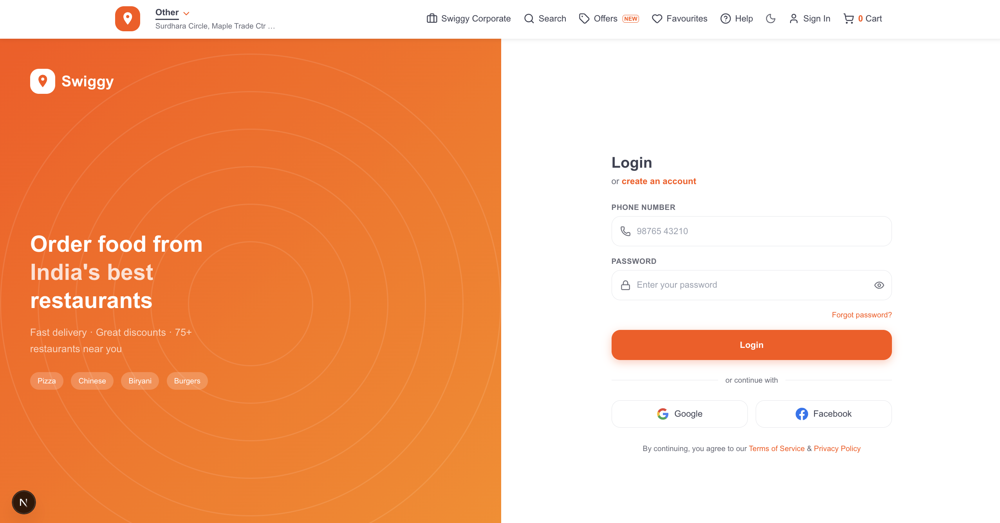
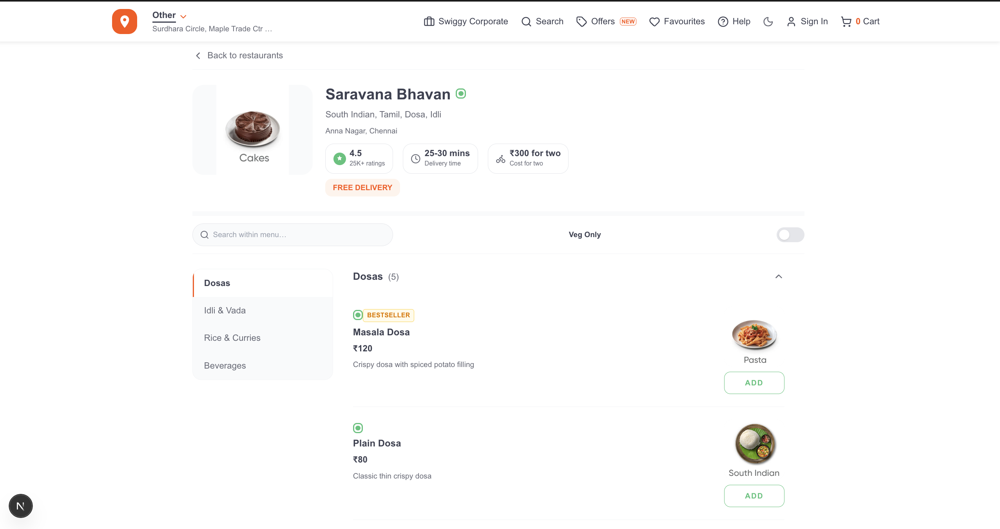
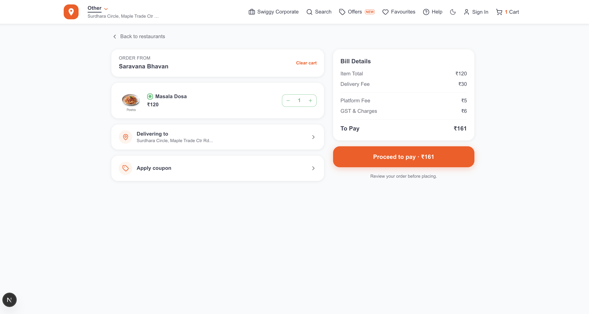
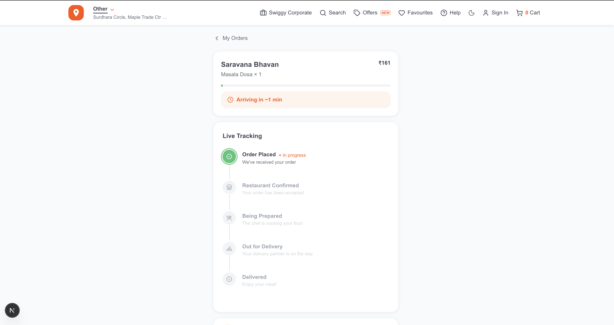

# Swiggy Clone

> A pixel-close frontend clone of India's most popular food delivery app, built with Next.js 16 App Router and React 19.

[](https://swiiggyyy.netlify.app/)
[](https://github.com/dania-01/swiggy)


---

## Screenshots

| Home | Login |
|------|-------|
|  |  |

| Restaurant Menu | Cart | Order Tracking |
|----------------|------|----------------|
|  |  |  |

---

## Features

- **Restaurant Listing** — 90 restaurants in a responsive grid with ratings, delivery time, pricing, and discount badges
- **Cuisine Browsing** — 20 cuisine categories ("What's on your mind?" section) linking to filtered listings
- **Search** — real-time restaurant and food name search from the filter bar
- **Filters & Sort** — sort by relevance, rating, delivery time, or price; filter by Pure Veg, 4.0+ rating, under 30 min delivery, and active offers
- **Restaurant Detail & Menu** — menu organized by category, sticky section navigation on desktop, scrollable tabs on mobile
- **Cart** — add/remove items with quantity controls; automatically clears if you switch restaurants (matching real Swiggy behavior)
- **Favorites** — heart-toggle restaurants; persisted across sessions via localStorage
- **Order History** — orders saved locally and browsable per order
- **Location Selection** — detect your location via the browser Geolocation API with a reverse-geocoded human-readable address, or choose manually
- **Auth Pages** — login and signup forms (UI only; no backend)
- **Dark / Light Theme** — system preference detected on first load; persisted in localStorage; flash-free via inline script in `<head>`
- **Skeleton Loading** — loading states on the restaurant page while menu data resolves
- **Custom 404** — branded not-found page
- **Fully Responsive** — mobile-first layout that scales to desktop without layout breakage

---

## How It Works

1. **Browse** — The home page loads 90 restaurants from a static data file. Use the cuisine tiles to jump to a filtered category view, or use the filter bar to sort and narrow results by veg, rating, delivery time, or offers.

2. **Order** — Click any restaurant to view its full menu. Add items to your cart — the cart bar floats at the bottom while you browse. The cart enforces single-restaurant ordering (just like the real app).

3. **Checkout** — Head to the cart page to review your order, see the price breakdown with delivery fee and GST, and place the order. Orders are saved to localStorage and visible under Order History.

---

## Tech Stack

| Layer | Choice |
|---|---|
| **Framework** | Next.js 16 (App Router, Turbopack) |
| **Runtime** | React 19 |
| **Styling** | Tailwind CSS v4 (CSS-first config — no `tailwind.config.js`) |
| **UI Components** | shadcn/ui (copied into project, fully owned and customized) |
| **Icons** | Lucide React |
| **State Management** | React Context API + `useReducer` (no Redux, no Zustand) |
| **Geocoding** | Browser Geolocation API + Nominatim (OpenStreetMap) |
| **Font** | Gilroy → Arial → Helvetica Neue (Swiggy's exact font stack) |
| **Deployment** | Netlify via `@netlify/plugin-nextjs` |

---

## Tech Highlights

### State Management
All global state is handled with React's built-in primitives — no third-party state library. Five context providers wrap the app:

| Context | Mechanism | What it manages |
|---|---|---|
| `CartContext` | `useReducer` | Cart items, quantities, total price, single-restaurant enforcement |
| `LocationContext` | `useState` | Current delivery address (shared between Header and Cart) |
| `AuthContext` | `useState` | Logged-in user session |
| `ThemeContext` | `useState` + `localStorage` | Dark/light mode with OS preference detection |
| `ToastContext` | `useState` | App-wide toast notifications |

The cart reducer handles three actions (`ADD_ITEM`, `REMOVE_ITEM`, `CLEAR_CART`). `ADD_ITEM` includes a guard: if the incoming item belongs to a different restaurant than the active cart, it auto-clears and starts fresh — identical to the real Swiggy behavior.

### Responsive Design
The UI is mobile-first throughout:
- **Filter bar** uses `IntersectionObserver` on a sentinel element to detect scroll position. Past the fold it collapses from the full filter-chip layout to a compact sort + search bar — matching Swiggy's exact scroll behavior.
- **Menu navigation** uses a second `IntersectionObserver` to track the active menu category. On `lg+` screens this highlights a sticky sidebar item; on smaller screens it auto-scrolls a horizontal tab strip.
- Images are served through Next.js `<Image>` with remote patterns configured for Swiggy's CDN, getting automatic WebP conversion and lazy loading for free.

### Custom Hooks
Three custom hooks extract reusable logic from component files:

- **`useCart`** (`src/hooks/useCart.js`) — wraps `CartContext` and exposes `addItem`, `removeItem`, `clearCart`, `getItemQuantity`, and `isFromDifferentRestaurant` as a clean, call-site-friendly API.
- **`useFavorites`** (`src/hooks/useFavorites.js`) — manages a `Set` of favorited restaurant IDs backed by `localStorage`. Uses `useCallback` to keep `toggle` and `isFavorite` stable across renders.
- **`useOrders`** (`src/hooks/useOrders.js`) — manages order history array in `localStorage`. New orders are prepended so the most recent always appears first.

---

## API Integration

This project uses **static mock data** — no live API calls are made at runtime.

**Why not the real Swiggy API?**

Swiggy's API does not expose public CORS headers, so browser-based `fetch` calls are blocked. Workarounds like browser extensions or proxy services are fragile and not suitable for a deployed app.

**What the data layer looks like:**

```
src/lib/data/
├── restaurants.js   — 90 restaurants (id, name, cuisines, rating, delivery time,
│                      price, discount, isVeg, locality)
└── menuItems.js     — 10 cuisine menu templates mapped to restaurants
```

Restaurant card images are served from Swiggy's real CDN (`media-assets.swiggy.com`) using image IDs extracted from their public marketing assets — so the visual experience is accurate even without a live API.

**What I'd do with a backend:**

With a Node.js/Express proxy or a Next.js Route Handler (`/api/restaurants`), the server would call Swiggy's API server-to-server (no CORS restriction), cache the response with Redis or Next.js `unstable_cache`, and return clean JSON to the client. The data layer would swap from static imports to `fetch` calls with no changes to the UI components.

---

## Getting Started

```bash
# Clone
git clone https://github.com/dania-01/swiggy.git
cd swiggy

# Install
npm install

# Run (Turbopack dev server)
npm run dev
# → open http://localhost:3000

# Production build
npm run build
npm run start
```

**Node requirement:** 18.17+ (Next.js 16 minimum)

---

## What I Learned

- **Next.js App Router patterns** — keeping page files thin by moving all UI into `sections/`, using `generateMetadata` for per-page SEO, and understanding the server vs. client component boundary.
- **Tailwind CSS v4's CSS-first config** — defining design tokens as CSS custom properties inside `@theme` instead of a JS config file, and using the new `text-(--var)` shorthand syntax.
- **IntersectionObserver for scroll-driven UI** — replacing scroll event listeners (which run on every pixel of scroll) with an observer that fires only when an element crosses a threshold. Used in two places: the sticky filter bar and the menu section tracker.
- **Context + useReducer as a Redux alternative** — for a project of this scale, a typed reducer with a handful of well-named actions is all the state management needed. Redux would have added boilerplate without benefit.
- **CORS and the limits of client-only apps** — hitting the Swiggy API restriction made me think practically about how production apps solve this with server-side proxies and caching layers.
- **Flash of unstyled dark mode** — the technique of injecting an inline `<script>` in `<head>` to set the theme class before React hydrates, preventing the visible light → dark flash on page load.

---

## Author

**Dania Khan**
- GitHub: [@dania-01](https://github.com/dania-01)
- Email: daniakhan0412@gmail.com

---

*This project is for learning and portfolio purposes only. Swiggy is a registered trademark of Bundl Technologies Pvt. Ltd. This clone is not affiliated with or endorsed by Swiggy.*
